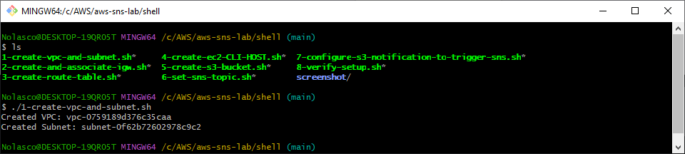
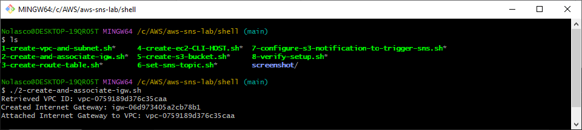
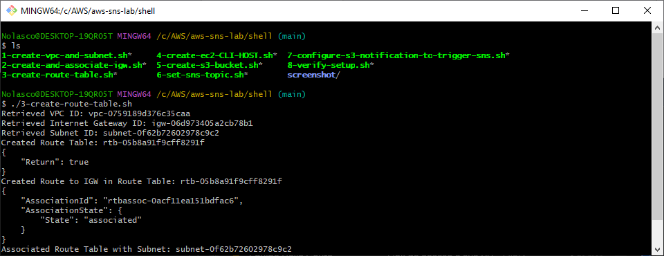
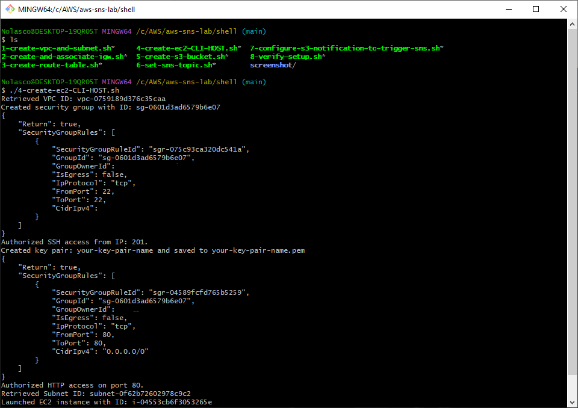
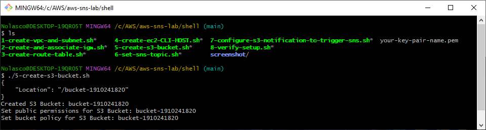
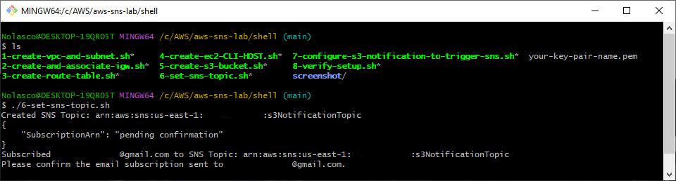
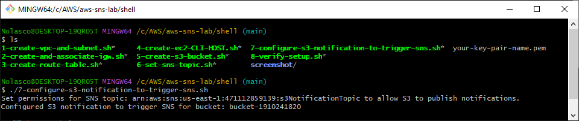
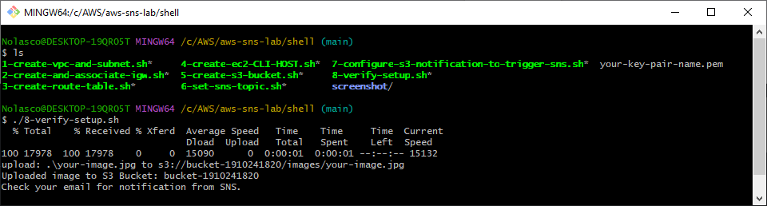

## Overview
You can execute these scripts as an alternative to manual resource creation in the AWS Management Console. 

## Execution Order

Please run the scripts in the following order:
- Edit the scripts according to your needs before running them

1. **Create VPC and Subnet**
```bash
./1-create-vpc-and-subnet
```

<div align="center">
  
</div>

---

2. **Create and Associate an Internet Gateway (IGW)**
```bash
./2-create-and-associate-igw
```

<div align="center">
  
</div>

---

3. **Create a Route Table and Configure Route to IGW**
```bash
./3-create-route-table
```

<div align="center">
  
</div>

---

4. **Create and Configure the EC2 Instance (CLI Host)**
```bash
./4-create-ec2-CLI-HOST
```

<div align="center">
  
</div>

---

5. **Create the S3 Bucket**
```bash
./5-create-s3-bucket
```

<div align="center">
  
</div>

---

6. **Set Up SNS Topic**
```bash
./6-set-sns-topic
```

<div align="center">
  
</div>

---

7. **Configure S3 Notification to Trigger SNS**
```bash
./7-configure-s3-notification-to-trigger-sns
```

<div align="center">
  
</div>

---

8. **Verify the Setup**
```bash
./8-verify-setup
```

<div align="center">
  
</div>


